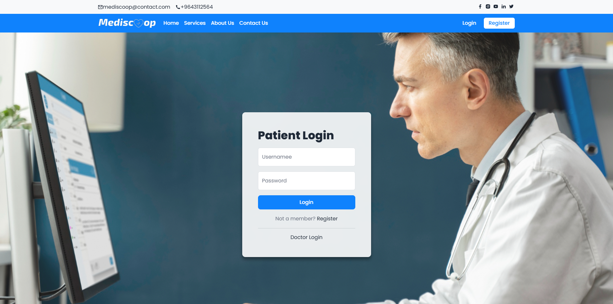
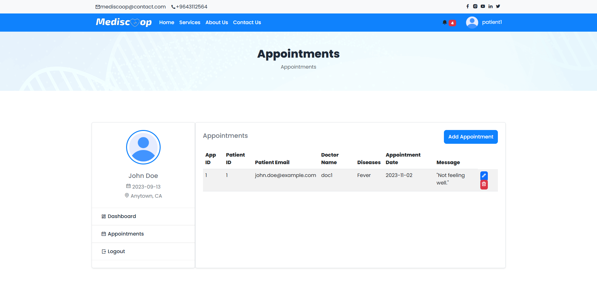
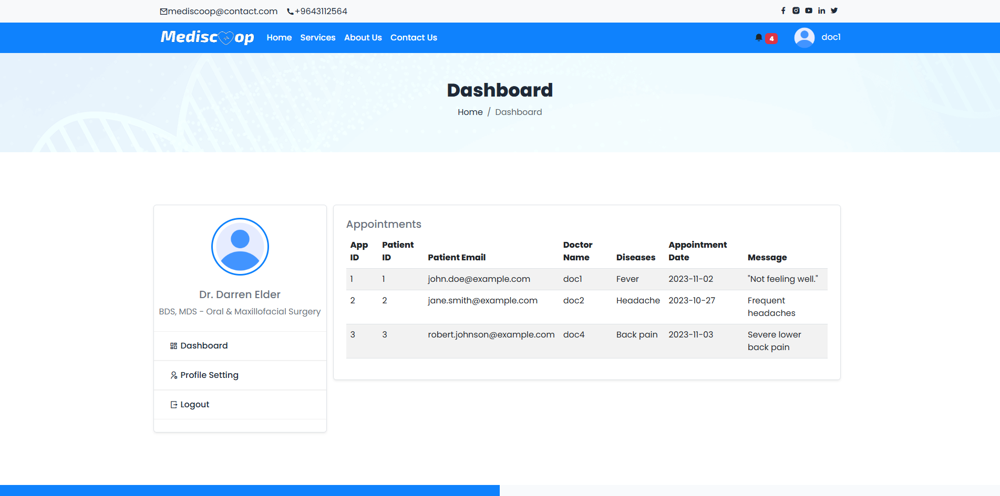
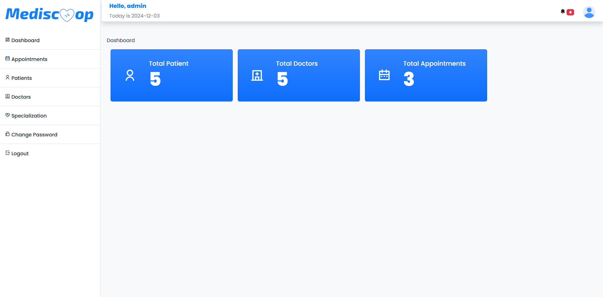
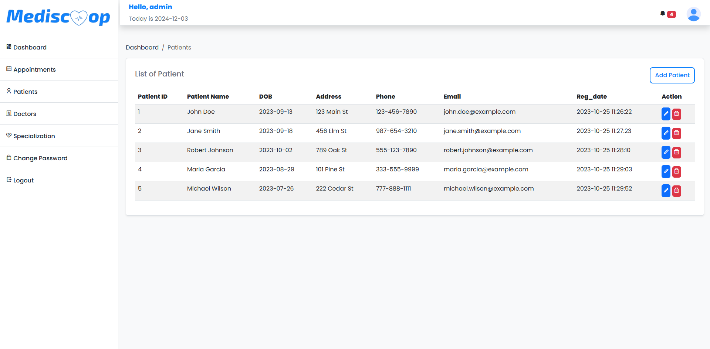
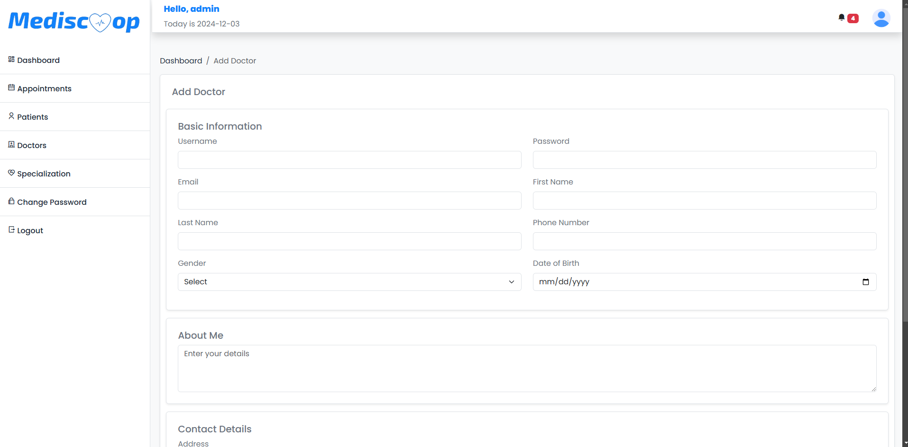
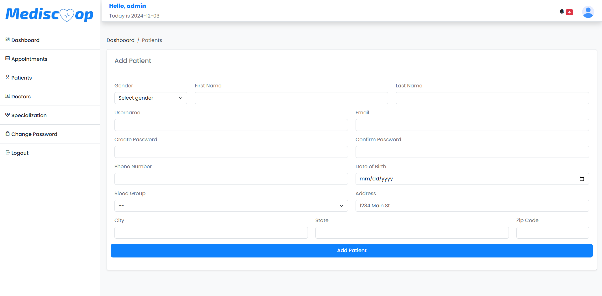

# 🏥 Mediscoop - Hospital Management System  

Mediscoop is a feature-rich **Hospital Management System** built with HTML, CSS, JavaScript, Java, and MySQL. This system facilitates efficient management of hospital operations, allowing **patients**, **doctors**, and **administrators** to interact seamlessly through personalized dashboards.

---

## 🌟 **Screenshots**
<p align="center">
  
  
  
  
  
  
  
  
  
</p>

---

## 🌟 Features  

### 👩‍⚕️ Patient  
- **Register** on the platform.  
- **Login** and access a personalized dashboard.  
- **Make appointments** with doctors.  

### 🩺 Doctor  
- **Register** and **login** to the system.  
- **View appointments** assigned to them.  

### 🔐 Admin  
- **Patient Management**: Add, update, remove, and review detailed patient records efficiently.  
- **Doctor Management**: Oversee doctor profiles, update credentials, and maintain accurate information.  
- **Specialization Management**: Define, organize, and edit specialization categories for seamless doctor-patient alignment.
- **Appointment Oversight**: Access and monitor all scheduled appointments for comprehensive system oversight.

---

## 🚀 How to Access  

### 🛠 Admin Login  
- **URL**: [Admin Login](/Mediscoop/admin/admin-login.jsp)  
- **Username**: `admin`  
- **Password**: `admin`  

### 👨‍⚕️ Doctor Login  
- **URL**: [Doctor Login](/Mediscoop/doctor/doctor-login.jsp)  
- **Username**: `doc1`  
- **Password**: `doc1`  

### 🧑‍💻 Patient Login  
- **URL**: [Patient Login](9/Mediscoop/login.jsp)  
- **Username**: `patient1`  
- **Password**: `patient1`  

---

## 🛠 Technologies Used  
- **Frontend**: HTML, CSS, JavaScript  
- **Backend**: Java (Servlets & JSP)  
- **Database**: MySQL  

---

## 🏗 Project Setup  
1. Clone the repository:  
   ```bash  
   git clone https://github.com/eranmadhuka/Mediscoop.git

2. Navigate to the db folder and import the SQL file into your MySQL server
     File path: db/mediscoop.sql
   
3. Configure the database connection in the project files.
4. Deploy the project on a Tomcat server.
5. Access the application using the URLs provided above.

